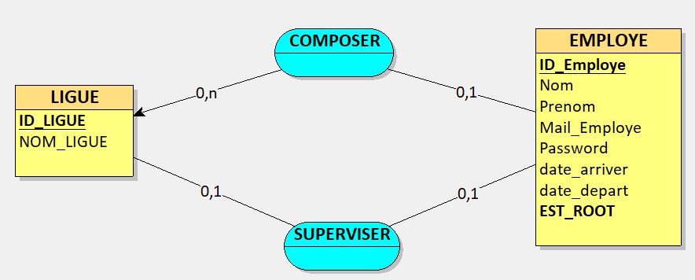

# Présentation des données 
> Un employé par ligue mais il ne dispose d’aucun droit d’écriture.

> Un employé par ligue est admininstrateur et dispose de droits d’écriture peut gérer la liste des emloyés de sa propre ligue avec une application bureau.

> Le super-admininstrateur(root) a accès en écriture à tous les employés des ligues. Il peut aussi gérer les comptes des administrateurs des ligues avec une application accessible en ligne de commande.

> Un seul employé n'appartient à aucune ligue c'est le root 

## MCD DE LA LGUE

### EXPLICATION DES RELATIONS
> Il ya deux entités une entité LIGUE et EMPLOYE

> les deux entités sont liées par des associations COMPSER() et SUPERVISER()

> **Cardinalité**
COMPOSER (0,n) du côté Ligue signifie que La ligue peut être composé de 0 ou plusieurs employés
   (0,1) du côté **Employé** signifie qu'un employé appartient au plus à une Ligue. 

>SUPERVISER (0,1) côté LIGUE signifie qu'une ligue ne peut etre supervisé que par zéro ou un employé(Admin de la ligue).
- le cas Zéro est là pour traduire le fait que lorsque la ligue n'a pas d'employés elle est supervisée par le **ROOT**

>SUPERVISER(0,1) côté **EMPLOYE** signifie qu'un employé par LIGUE est Admin et qu'il n'administre que sa ligue.
- Autrement dit un employé ne gere que 0 ou 1 ligue.
- Le seul employé à gerer plusieurs ligues c'est le **root** 